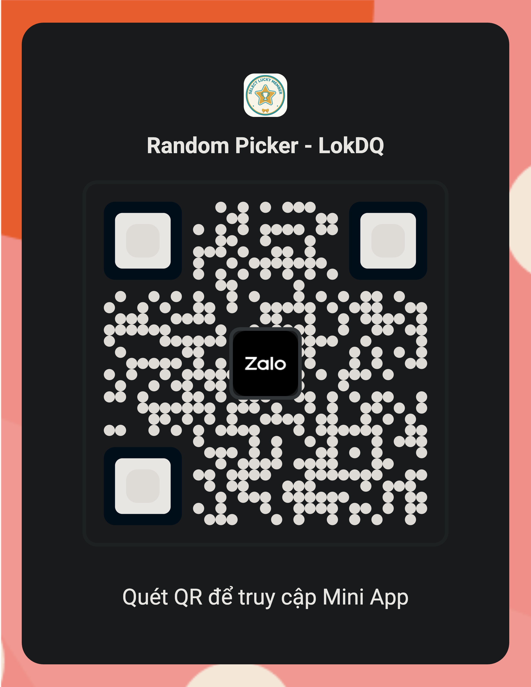
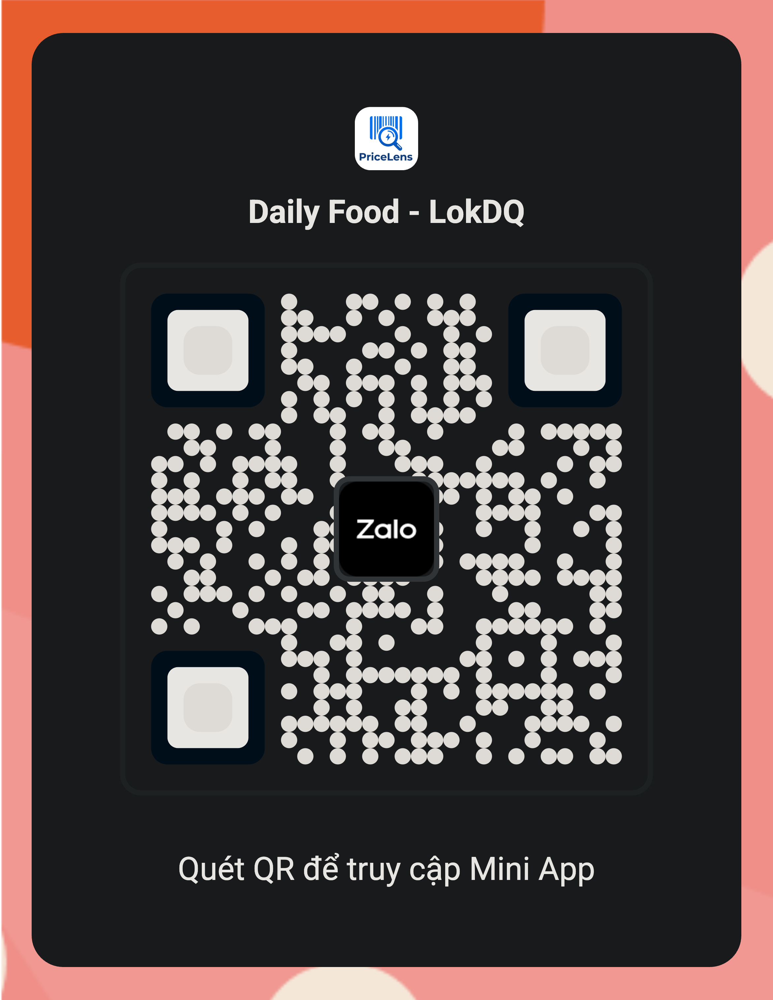
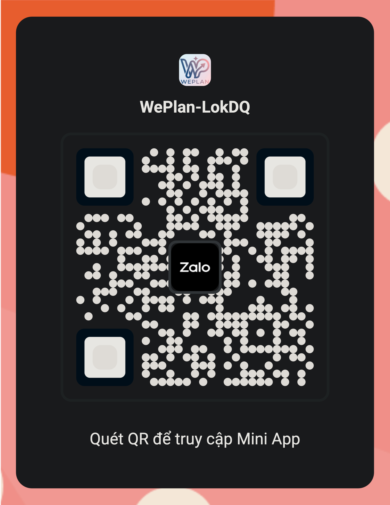

# 🚀 Zalo Mini App Collection - LokDQ

Chào mừng bạn đến với bộ sưu tập các **Zalo Mini App** do **LokDQ** phát triển! Các ứng dụng được thiết kế nhằm mang lại sự tiện lợi, giải quyết các nhu cầu thường ngày nhanh chóng trực tiếp trên nền tảng Zalo.

---

## 📱 Danh sách Mini App

| Tên hiển thị (DisplayName) | Tên ứng dụng (Name) | App ID | Trạng thái |
| :--- | :--- | :--- | :--- |
| **Random Picker - LokDQ** | Random Picker | `1516033360579317275` | Hoạt động |
| **Daily Food - LokDQ** | Daily Food | `367545130607154173` | Hoạt động |
| **WePlan-LokDQ** | WePlan | `1599413094155518304` | Hoạt động |

---

## 🎯 Chi tiết & QR Code trải nghiệm

Bạn có thể mở ứng dụng bằng cách quét mã QR tương ứng bên dưới bằng camera điện thoại hoặc ứng dụng Zalo:

### 1. Random Picker - LokDQ
* **Mô tả:** Ứng dụng giúp quay số ngẫu nhiên, bốc thăm trúng thưởng hoặc đưa ra quyết định nhanh chóng cho các trò chơi, sự kiện.
* **App ID:** `1516033360579317275`
* **QR Code:** 
  > *(Thay thế link ảnh bên dưới bằng QR code thực tế của bạn)*
  > 
* **Link truy cập:** [Mở trên Zalo Mini App](https://zalo.me/s/1516033360579317275)

---

### 2. Daily Food - LokDQ
* **Mô tả:** Giải quyết câu hỏi kinh điển "Hôm nay ăn gì?". Gợi ý món ăn mỗi ngày, giúp bạn lên thực đơn hoặc chọn món một cách vui vẻ.
* **App ID:** `367545130607154173`
* **QR Code:** 
  > *(Thay thế link ảnh bên dưới bằng QR code thực tế của bạn)*
  > )
* **Link truy cập:** [Mở trên Zalo Mini App](https://zalo.me/s/367545130607154173)

---

### 3. WePlan - LokDQ
* **Mô tả:** Ứng dụng hỗ trợ lên kế hoạch, sắp xếp công việc và lịch trình cá nhân hoặc nhóm một cách khoa học.
* **App ID:** `1599413094155518304`
* **QR Code:** 
  > *(Thay thế link ảnh bên dưới bằng QR code thực tế của bạn)*
  > )
* **Link truy cập:** [Mở trên Zalo Mini App](https://zalo.me/s/1599413094155518304)

---

## 🛠️ Công nghệ sử dụng
* Zalo Mini App SDK / Zalo Mini App Framework
* ReactJS / VueJS / Native

---

## 📞 Liên hệ & Hỗ trợ
Mọi đóng góp, báo lỗi hoặc thắc mắc về các ứng dụng, vui lòng liên hệ:
* **Tác giả:** LokDQ
* **GitHub:** [LokDQ's Profile](https://github.com/LokDQ)

---
*© 2026 LokDQ. All rights reserved.*
